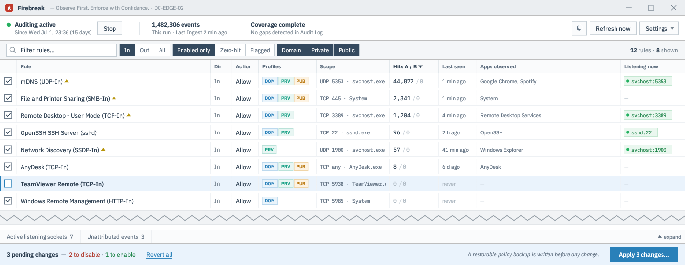

# Firebreak

**Observe first. Enforce with confidence.**
Turn real network activity into least-privilege firewall policy.

On-demand tool (no service, no driver) that answers: **which firewall rules
are actually being matched, by which applications, and how often** — so
unused rules can be disabled and used-but-broad rules can be security-vetted.

It works by correlating Windows' own WFP audit events (Security log 5156
allowed / 5157 blocked) against the live WFP filter table and
`Get-NetFirewallRule`.



## Download

Grab the latest `firebreak.exe` from the
[**Releases**](https://github.com/ghostpsalm/firebreak/releases/latest) page
and run it. Windows may warn on the unsigned binary — SmartScreen → *More
info → Run anyway*. Firebreak can also update itself in place (**About → Check
for updates**).

**Requires:** Windows 10 or later / Windows Server 2016 or later, and
administrator rights.

## Start collecting early (important)

Firebreak doesn't capture packets — it reads evidence that **Windows itself
records** once "Filtering Platform Connection" auditing is enabled. That
auditing is off by default, and there is **no retroactive data**: evidence
only accrues from the moment it's switched on. Enable it as early as you can,
then come back — good zero-hit conclusions need the collection window to cover
weekly and monthly activity (backup agents, license checks), so think **weeks,
not hours**.

Two ways to start the clock:

1. **Run Firebreak** and click **Enable connection auditing** — it records the
   prior state first (reversible via `--restore-audit`), then enables auditing
   and grows the Security log so history survives until you return.
2. **No install needed** — run this on the target ahead of time (elevated),
   and Firebreak will adopt the accumulated history whenever you first run it:

   ```
   auditpol /set /subcategory:{0CCE9226-69AE-11D9-BED3-505054503030} /success:enable /failure:enable
   wevtutil sl Security /ms:536870912
   ```

   (The second line grows the Security log to 512 MiB — the default 20 MiB
   rolls over in hours on a busy host, silently discarding your evidence.)

## Build from source

Native on Windows: `cargo build --release`
Cross from Linux: `cargo build --release --target x86_64-pc-windows-gnu`
(needs `mingw64-gcc` and the rustup target). `cargo test` runs on either.

## Run

Double-click the exe — an embedded `requireAdministrator` manifest brings up
the UAC prompt (Firebreak needs admin for audit policy, the Security log, and
WFP access). The app boots straight to the rule table; everything else happens
on background workers:

1. **First run (auditing off):** the header shows an **Enable connection
   auditing** button. Clicking it records the pre-existing audit state and
   log size (so `--restore-audit` can put the host back exactly as found),
   enables the "Filtering Platform Connection" subcategory, grows the
   Security log to 512 MiB if smaller, snapshots the rule set, and starts
   the collection clock. There is no retroactive data — enable as early as
   possible, then come back days/weeks later. Meanwhile the table already
   shows every rule with its scope and current listeners.
2. **Auditing already on, first run of the tool:** adopts whatever history
   the Security log still holds and analyzes it.
3. **Normal run:** ingests events since the last checkpoint (tracked by
   Security-channel EventRecordID — exact, no re-reads or drops), aggregates
   per-rule usage into `%ProgramData%\firebreak\firebreak.db`, and shows the
   report. Ingestion is a single transaction: a crash rolls back cleanly and
   the rerun cannot double-count.

Headless flags (attach to the launching terminal): `--enable-only`, `--no-ui`
(text report), `--dump-filters` (diagnostics), `--restore-audit` (revert audit
policy + log size to the recorded pre-Firebreak state), `--ui-preview`
(mock-data UI), `--db <path>`.

## Audit another PC (offline)

Firebreak can review a machine you're not sitting at. On the target device
(elevated), produce a bundle — rules, network profiles, and the filtered
Security events, zipped together:

```
firebreak.exe --collect
```

Can't run the exe on that box? **Settings → Save collection script (.ps1)…**
writes a standalone PowerShell collector that produces the same bundle.

Bring the `firebreak-export-<host>-<stamp>.zip` back and open it with
**Settings → Import Firebreak export…**. It analyses that device's rules
against its own events — a **read-only** review session (you can't reach out
and change another machine's firewall, so Apply is disabled). The target must
have had connection auditing running first (see above), or there'll be no
events to collect.

## What you see

Per rule: profile tags (with Domain/Private/Public view filters — default view
is **enabled rules only**), scope (protocol/ports/program), allow/block hit
counts, last-seen time, the applications observed hitting it, and **which
process is currently listening** on an inbound rule's ports. Collapsible bottom
panels list all active listening sockets and the unattributed events with the
WFP filter names they matched.

Checkboxes set the intended enabled-state; **Apply** runs on a background
thread and first writes a full policy backup to
`%ProgramData%\firebreak\backups\firewall-<stamp>.wfw` (restore with
`netsh advfirewall import <file>`) before committing via `Set-NetFirewallRule`
— nothing is applied if the backup fails.

## Caveats

- **Zero-hit enabled rules** are disable candidates — but only after the
  collection window has covered weekly/monthly-cadence activity (backup
  agents, license checks). Check "Collecting since" in the header.
- A **coverage-gap warning** means the log's oldest surviving record is past
  the checkpoint: log rollover, a cleared log, or a period with auditing
  disabled. Zero-hit conclusions are weaker across such a gap.
- **Attribution is per-boot.** Run Firebreak at least once per boot session
  for tight attribution. Unattributed events are normal — and for blocked
  traffic, expected (port scans and other unsolicited traffic match WFP's
  built-in default-block filters, which aren't firewall rules).
- Local audit policy can be reverted by **Group Policy** refresh. If event
  ingestion drops to zero unexpectedly, re-check with:
  `auditpol /get /subcategory:{0CCE9226-69AE-11D9-BED3-505054503030}`

## What Firebreak is not

- Not a packet-capture or WFP callout driver — Windows already records
  everything needed; this only reads it.
- Not per-packet accounting: "Filtering Platform Connection" auditing is
  per-connection/flow. The per-packet subcategory ("Filtering Platform
  Packet Drop") is intentionally never enabled.
